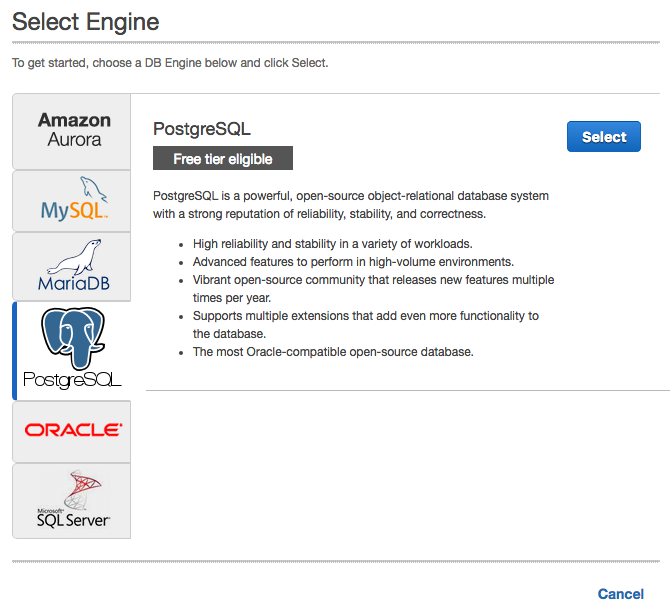
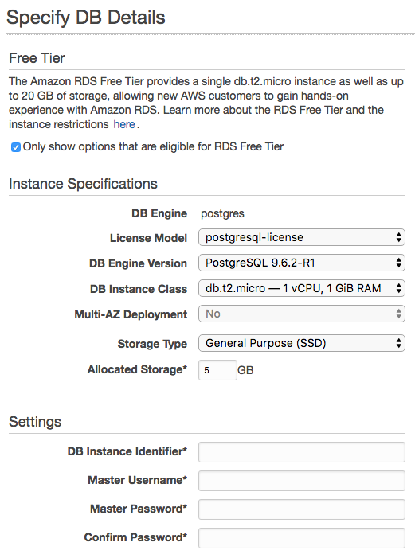
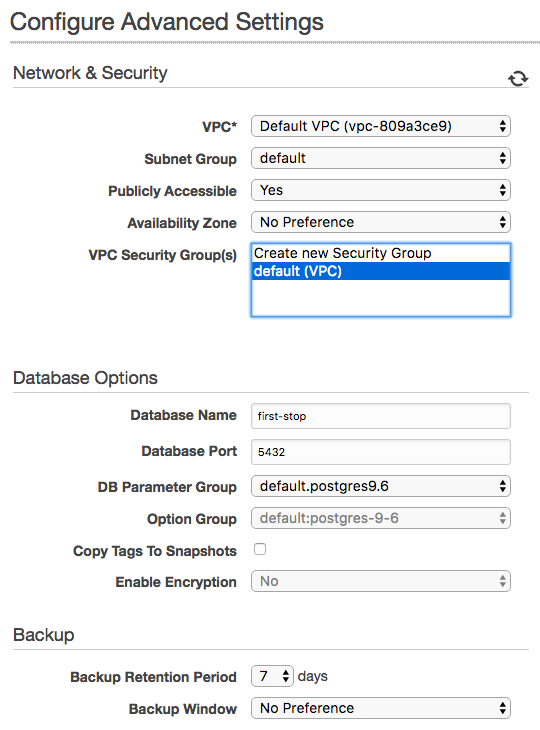
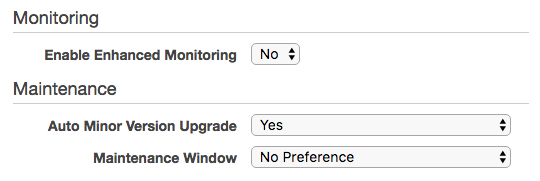

# First Stop Tech Test

Please email me for logon details to allow access to the s3 bucket used for uploading the xml files to.

If your version of node is less than 7.6, then please read the section 'Running the tests' - there is no need to upgrade.

## Overview
A brief description of what this system does:
1. xml files with the extension xml.txt are uploaded to a specific s3 bucket (only using the AWS console at present). For each file added a Lambda function is automatically triggered to process the file.
2. The Lambda function gets a copy of each file from the bucket and performs the following actions:
    - Converts the xml file to a JSON representation
    - Recursively searches the JSON object for the key 'ReturnedDebitItem'
    - Reformats each item in the resulting array of returned debit items to clean up the presentation and add the filename the item came from for easy reference
    - Stores the full JSON object in a database in JSONB format, which allows the JSON object to be directly queried using slightly modified database queries, for example
      ```sql
      SELECT item_json->>'ref' 
      AS rdi_ref 
      FROM returned_debit_items
      ```
      compared with
      ```sql
      SELECT id 
      FROM returned_debit_items
      AS rdi_id
      ```
    - Stores each returned debit item in the database in JSONB format along with the unique database id number of the full JSON object it came from. The individual reference number from each item has been broken out into a separate column for easier querying.
    - copies the original file to an archive bucket and renames it
    - deletes the original file
3. Additonally there is an [API endpoint](https://eanzkos0nk.execute-api.eu-west-2.amazonaws.com/dev/get-debit-items) to allow access to the returned debit items from a web browser
    - This is also powered by a Lambda function and makes use of the AWS API endpoint service
    - It will display the 10 newest returned debit items in the database with the newest at the top
3. There is also a local unit testing environment. The Lambda functions themselves have not been 
unit tested, but just about every function they use has tests. 
    - The tests make use of an npm package called [mock-aws-s3](https://www.npmjs.com/package/mock-aws-s3) which uses the local file system and replicates the s3 API. This allows actual files to be used in the tests without making calls to the real AWS s3 service.
    - A local postgreSQL database is used in the tests so that calls to the AWS RDS database are not needed during testing.
4. The Lambda functions have been manually integregration tested by bulding them up bit-by-bit using the tested helper functions and checking they work as expected, making use of console.logs and errors that show up in the AWS CloudWatch logs. A local database manager app ([pgAdmin 4](https://www.pgadmin.org/)) was used to monitor the AWS RDS (and local) database.
5. I have used the [Serverless Framework](https://serverless.com/) to build out the the AWS infrastructure. Additionally, I have used the [serverless-webpack](https://www.npmjs.com/package/serverless-webpack) plugin in combination with the babel 'env' preset to specifically target the Node 6.10 runtime available on AWS Lambda. I have also used 'babili' to minify the code. This setup allows me to use async / await (and any other 'new' javascript code I fancy) and have it transpiled and still run on AWS Lambda.

# Running the tests
1. The following instructions are for a Mac - if you are running Windows or Linux then links to further resources are provided.
1. You will need node and npm installed to run these tests and run the scripts in the package.json file. Check to see if you have them installed by running:
    ```
    node -v
    npm -v
    ```
    If these are not installed, check to see if you have [Homebrew](https://brew.sh/) (a package manager for OSX) installed using this command
    ```
    brew -v
    ```
    If this is not available, it can be installed using
    ```
    /usr/bin/ruby -e "$(curl -fsSL https://raw.githubusercontent.com/Homebrew/install/master/install)"
    ```
    Once you have Homebrew, node and npm can be installed with one command
    ```
    brew update && brew doctor && brew install node
    ```
    If you are not on a Mac, then follow the instructions [here](https://nodejs.org/en/download/current/)
1. Clone the repository to a local folder. For this you will need git installed. Follow the instructions [here](https://git-scm.com/book/en/v2/Getting-Started-Installing-Git).
2. Install the dependencies. I used Yarn, but npm works too! Yarn can be installed by running the following command
    ```
    brew update && brew doctor && brew install yarn
    ```
3. The tests need a local install of the postgreSQL database server. For the Mac, I used the [Postgres.app](http://postgresapp.com/). This automatically installs the psql command line tools and starts a server when it is running. For other platforms, instructions are available [here](https://www.postgresql.org/download/). Once psql has been installed, run the following command to setup the database
      ```
      createdb first_stop
      ```
      Once this is done, from the project folder command line run the following command to setup the database tables ready to receive the data from the tests.
    - node >= 7.6  
      ```
      npm run db-init-local
      ```
      If this fails to run, you may not have a recent enough version of node installed. Some of the code is written in es7 async/await style, which requires at least node 7.6 to run. If your version is older than this and you do not want to update node, then simply run instead
    - node < 7.6
      ```
      npm run w-db-init-local
      ```
      This command will use webpack and babel to compile the code down to the version of node you are currently running (automatically detected - no input required from you!), then setup the database tables.
4. To monitor activity on the database (local or AWS), I used [pgAdmin 4](https://www.pgadmin.org/), a free gui for interacting with PostgreSQL databases. This is not required to run the tests, but is really helpful for making sure everyting is being saved correctly. 
    - Alternatively, the command line psql utility (automatically installed with Postgres app on the mac) the can be used. I found the easiest way to use this is to set up a scratch file with the necessary queries. For example, a basic query file might look like
      ```sql
      \c first_stop;

      SELECT * FROM full_json;

      SELECT * FROM returned_debit_items;
      ```
    - The '\c first-stop' ensures you are connected to the correct database.
    - If the folowing command is run
      ```
      psql -f YOUR-FILENAME-HERE > result.txt
      ```
      the results will be piped to a text file for easier digesting or saving.
3. Once everything is installed, cd into the project folder and from the command line run
    - node >= 7.6
    ```
    npm t
    ```
    - node < 7.6 (uses webpack and babel again)
    ```
    npm run wt
    ```
    Hopefully all the tests will pass!
## S3, Serverless, and Lambda initial setup
1. Create a free AWS account if you do not already have one at  <https://aws.amazon.com/free/>
2. Create a new user with the permissions required to setup and run the serverless framework by following the instructions [here](http://docs.aws.amazon.com/IAM/latest/UserGuide/id_users_create.html). If you already have an AWS account with admin privileges then you can skip this step.
   - I called my user 'serverless', only allowed programmatic access, and attached a custom policy with the following permissions. (Taken from [here](https://gist.github.com/WarlaxZ/b2d8299c7545d43a561c68530a3a7381))
      ```json
      {
        "Version": "2012-10-17",
        "Statement": [
          {
            "Effect": "Allow",
            "Action": [
              "cloudformation:CreateStack",
              "cloudformation:UpdateStack",
              "cloudformation:DescribeStacks",
              "cloudformation:ListStacks",
              "cloudformation:DescribeStackEvents",
              "cloudformation:DescribeStackResource",
              "cloudformation:DescribeStackResources",
              "iam:GetRole",
              "iam:CreateRole",
              "iam:CreatePolicy",
              "iam:PutRolePolicy",
              "iam:PassRole",
              "iam:AttachRolePolicy",
              "iam:DeleteRolePolicy",
              "lambda:GetFunction",
              "lambda:ListVersionsByFunction",
              "lambda:CreateFunction",
              "lambda:UpdateFunctionCode",
              "lambda:UpdateFunctionConfig",
              "lambda:GetFunctionConfiguration",
              "lambda:AddPermission",
              "lambda:PublishVersion",
              "lambda:RemovePermission",
              "lambda:DeleteFunction",
              "lambda:UpdateFunctionConfiguration",
              "s3:DeleteObject",
              "s3:GetObject",
              "s3:CreateBucket",
              "s3:ListBucket",
              "s3:PutObject",
              "s3:PutBucketNotification",
              "s3:DeleteBucket",
              "ec2:DescribeSecurityGroups",
              "ec2:DescribeSubnets",
              "ec2:DescribeVpcs",
              "apigateway:POST",
              "apigateway:GetResources",
              "apigateway:GET",
              "apigateway:PUT",
              "apigateway:DELETE",
              "logs:DescribeLogGroups",
              "logs:CreateLogGroup",
              "logs:PutLogEvents",
              "logs:DescribeLogStreams",
              "logs:FilterLogEvents",
              "logs:DeleteLogGroup"
            ],
            "Resource": "*"
          }
        ]
      }
      ```
    - Copy down the new users credentials (access key and secret), which can be viewed via the AWS IAM console.
3. Install the Serverless framework globally - see [here](https://serverless.com/framework/docs/providers/aws/guide/quick-start/)
      ```
      npm install -g serverless
      ```
4. Using the user credentials obtained above, [setup a local config file](https://serverless.com/framework/docs/providers/aws/guide/credentials/)
      ```
      serverless config credentials --provider aws --key USER-KEY --secret USER-SECRET
      ```
3. Set up a fresh Serverless project in a new project folder
   - From within project folder run (sls is shorthand for serverless, -t is short for template)
      ```
      sls create -t aws-nodejs
      ```
4. Locally install dev dependencies - I used Yarn, but npm works too!
   - NOTE: asw-sdk is a dev dependency here as it is included in the AWS Lambda runtime and so I do not want it in the zip package being sent up to AWS. dev dependencies have been excluded from the deployment package in the webpack and serverless config files.

4. Configure Webpack and Babel
   - I like and will be writing asynchronous code in async / await style as it is quicker to write and easier to read. Webpack and babel take care of ensuring the code will run on node 6.10, which is the latest version available on AWS Lambda at the time of writing. Ordinarily, this style would require at least node 7.6. You can check your own node version using 
      ```
      node -v 
      ```
    -  See the aws.webpack.config.js in the project root folder for the current setup.
      
4. Configure Serverless
    - See the serverless.yml file in the root folder for the current setup. This includes all of the setup for creating the s3 buckets and api gateway, the events that these services generate to invoke their respective Lambda functions, and the s3 permissions required by the Lambda functions to do their jobs.
    
5. Create basic Lambda function that will read the event data when triggered by an s3 event. This is what I started with. It console.logs the event object to the CloudWatch logs.
    ```javascript
    exports.handler = (event, context) => {
      context.callbackWaitsForEmptyEventLoop = false;
      console.log('Reading event:\n', JSON.stringify(event, null, 2));
    };
    ```
   - NOTE: console logs appear in the cloudwatch logs on AWS and are very useful for debugging and monitoring function progress!
6. The file structure now looks like this
    ```
    project-folder
    ├── lambda-functions
    │   └── process-xml.js
    ├── node_modules
    ├── package.json
    ├── serverless.yml
    ├── aws.webpack.config.js
    └── yarn.lock
    ```
7. Deploy the service to AWS
    ```
    sls deploy
    ```
9. I setup a new user that only has access to the AWS Console to list and add files to the 'first-xml' bucket, and list and download files in the 'first-xml-archive' bucket, with the following custom policy, determined by following the instructions [here](http://docs.aws.amazon.com/AmazonS3/latest/dev/example-policies-s3.html)
    ```json
    {
        "Version": "2012-10-17",
        "Statement": [
            {
                "Sid": "ListAllBuckets",
                "Effect": "Allow",
                "Action": [
                    "s3:ListAllMyBuckets",
                    "s3:GetBucketLocation"
                ],
                "Resource": [
                    "arn:aws:s3:::*"
                ]
            },
            {
                "Sid": "AllowListOfFirstXml",
                "Action": [
                    "s3:ListBucket"
                ],
                "Effect": "Allow",
                "Resource": [
                    "arn:aws:s3:::first-xml"
                ]
            },
            {
                "Sid": "AllowPutToFirstXml",
                "Action": [
                    "s3:PutObject"
                ],
                "Effect": "Allow",
                "Resource": [
                    "arn:aws:s3:::first-xml/*"
                ]
            },
            {
                "Sid": "AllowListOfFirstXmlArchived",
                "Action": [
                    "s3:ListBucket"
                ],
                "Effect": "Allow",
                "Resource": [
                    "arn:aws:s3:::first-xml-archived"
                ]
            },
            {
                "Sid": "AllowGetFromFirstXmlArchived",
                "Action": [
                    "s3:GetObject"
                ],
                "Effect": "Allow",
                "Resource": [
                    "arn:aws:s3:::first-xml-archived/*"
                ]
            }
        ]
    }
    ```
   - Note: there is currently no way to prevent a user seeing all of the buckets available in the AWS account, but they can only interact with the buckets specified in the ways defined in the above policy.
10. Test that the function works using the AWS console
    - Log into the s3 console, select the 'first-xml' bucket, and upload appropriately formatted XML text files. You may need to hit the refresh button in the console window to see the files.
    - The 'first-xml-archived' folder does not do anything at this point, but it is available to receive archived XML files once they have been processed.
    - Check the cloudwatch logs for any 'console.logs' written into the Lambda function. These can give an indication of function success. Any errors will also show up here.
11. Done!

## AWS RDS PostgreSQL database setup
1. Log into the AWS RDS Console and click the button to 'Launch a DB Instance'
2. Select the PostgreSQL option

3. Specify the DB details. Make a note of the settings once you have entered them. Click through to the next page. 
 
4. Just select the defaults, give the databae a name ('first-stop' in this case) and click through to finish the setup.
 
5. It may now take a few minutes to setup the database instance. Once complete, click on the instance to see more details and take a note of the 'Endpoint' URL.
6. Open the db-config.js file in the db-config folder and update as neccessary.
    ```javascript
    module.exports = {
      local: 'postgres://localhost:5432/first_stop',
      aws: {
        user: USER-NAME,
        password: DATABASE-PASSWORD,
        host: ENDPOINT-URL,
        port: DATABASE-PORT,
        database: DATABASE-NAME
      }
    };
    ```
      - The USER-NAME and DATABASE-PASSWORD come from step 3.
      - The DATABASE-PORT and DATABASE-NAME come from step 4.
      - The ENDPOINT-URL comes from step 5 - just be sure to remove the port number at the end so that it ends in '.com'.
7. Once the AWS RDS database is available, and the credentials have been entered as step 6, the tables need to be initialised. This is very similar to setting up the tables in the local database as detailed above. Run the following commands:
      - node >= 7.6
        ```
        npm run db-init-aws
        ```
      - node < 7.6 (uses webpack and babel)
        ```
        npm run w-db-init-aws
        ```
7. Now, when you run
    ```
    sls deploy
    ```
    with the latest version of the project files you should have a fully working system to process the uploaded xml files!
