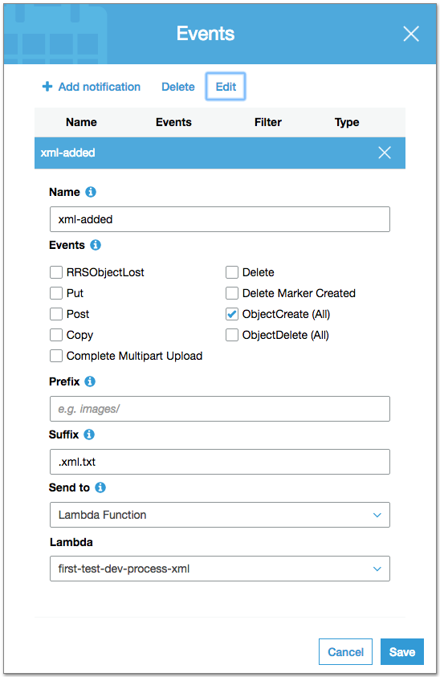

# s3, Serverless, and Lambda setup

1. Create a free AWS account if you do not already have one at  <https://aws.amazon.com/free/>
2. Create a user with the permissions required to setup and run the serverless framework by following the instructions [here](http://docs.aws.amazon.com/IAM/latest/UserGuide/id_users_create.html)
   - I called my user 'serverless', only allowed programmatic access, and attached a custom policy with the following permissions. (Taken from [here](https://gist.github.com/WarlaxZ/b2d8299c7545d43a561c68530a3a7381))
      ```json
      {
        "Version": "2012-10-17",
        "Statement": [
          {
            "Effect": "Allow",
            "Action": [
              "cloudformation:CreateStack",
              "cloudformation:UpdateStack",
              "cloudformation:DescribeStacks",
              "cloudformation:ListStacks",
              "cloudformation:DescribeStackEvents",
              "cloudformation:DescribeStackResource",
              "cloudformation:DescribeStackResources",
              "iam:GetRole",
              "iam:CreateRole",
              "iam:CreatePolicy",
              "iam:PutRolePolicy",
              "iam:PassRole",
              "iam:AttachRolePolicy",
              "lambda:GetFunction",
              "lambda:ListVersionsByFunction",
              "lambda:CreateFunction",
              "lambda:UpdateFunctionCode",
              "lambda:UpdateFunctionConfig",
              "lambda:GetFunctionConfiguration",
              "lambda:AddPermission",
              "lambda:PublishVersion",
              "lambda:RemovePermission",
              "lambda:DeleteFunction",
              "lambda:UpdateFunctionConfiguration",
              "s3:DeleteObject",
              "s3:GetObject",
              "s3:CreateBucket",
              "s3:ListBucket",
              "s3:PutObject",
              "ec2:DescribeSecurityGroups",
              "ec2:DescribeSubnets",
              "ec2:DescribeVpcs",
              "apigateway:POST",
              "apigateway:GetResources",
              "apigateway:GET",
              "apigateway:PUT",
              "apigateway:DELETE",
              "logs:DescribeLogGroups",
              "logs:CreateLogGroup",
              "logs:PutLogEvents",
              "logs:DescribeLogStreams",
              "logs:FilterLogEvents",
              "logs:DeleteLogGroup"
            ],
            "Resource": "*"
          }
        ]
      }
      ```
    - Copy down the new users credentials (access key and secret), which can be viewed via the AWS IAM console.
3. Install the Serverless framework globally
   - see <https://serverless.com/>
      ```
      npm install -g serverless
      ```
4. Using the user credentials obtained above, setup a local config file
      ```
      serverless config credentials --provider aws --key USER-KEY --secret USER-SECRET
      ```
3. Setup a fresh Serverless project in a new project folder
   - From within project folder run (sls is shorthand for serverless, -t is short for template)
      ```
      sls create -t aws-nodejs
      ```
4. Locally install dev dependencies - I used Yarn, but npm works too!
   - NOTE: asw-sdk is a dev dependency here as it is included in the AWS Lambda runtime and so I do not want it in the zip package being sent up to AWS
      ```json
      {
        "name": "backend",
        "version": "1.0.0",
        "main": "index.js",
        "license": "MIT",
        "devDependencies": {
          "aws-sdk": "^2.54.0",
          "babel-core": "^6.24.1",
          "babel-loader": "^7.0.0",
          "babel-preset-env": "^1.5.0",
          "babili": "^0.0.12",
          "serverless-webpack": "^1.0.0-rc.4",
          "webpack": "^2.5.1",
          "webpack-node-externals": "^1.6.0"
        }
      }
      ```

4. Configure webpack
   - I like and will be writing asynchronous code in async / await style as it is quicker to write and easier to read. Webpack and babel take care of ensuring the code will run on node 6.10, which is the latest version available on AWS Lambda at the time of writing. Ordinarily, this style would require at least node 7.6. You can check your own node version using 
      ```
      node -v 
      ```
   - webpack.config.js setup: 
      ```javascript
      const nodeExternals = require('webpack-node-externals');
      const path = require('path');

      module.exports = {
        entry: {
          'process-xml': './lambda-functions/process-xml.js',
        },
        target: 'node',
        externals: [
          // exclude all dev dependencies
          nodeExternals() 
        ],
        output: {
          libraryTarget: 'commonjs',
          path: path.join(__dirname, '.webpack'),
          filename: '[name].js'
        },
        module: {
          loaders: [
            {
              test: /\.js$/,
              loader: 'babel-loader',
              query: {
                presets: [
                  [
                    // using babel env preset to specifically target the 6.10 environment in AWS Lambda
                    'env',    
                    {
                      targets: {
                        node: '6.10'
                      }
                    }
                  ],
                  // using babel babili preset to minify code
                  'babili'    
                ]
              }
            }
          ]
        }
      };
      ```
4. Configure serverless.yml file
    ```
    service: first-test

    provider:
      name: aws
      runtime: nodejs6.10
      stage: dev
      region: eu-west-2
      
    package:
      individually: true

    plugins:
      - serverless-webpack

    custom:
      webpackIncludeModules: true

    functions:
      process-xml:
        handler: process-xml.handler
    ```


5. Create basic Lambda function that will read the event data when triggered by an s3 event
    ```javascript
    exports.handler = (event, context) => {
      context.callbackWaitsForEmptyEventLoop = false;
      console.log('Reading event:\n', JSON.stringify(event, null, 2));
    };
    ```
   - NOTE: console logs appear in the cloudwatch logs on AWS and are very useful for debugging and monitoring function progress!
6. The file structure now looks like this
    ```
    project-folder
    ├── lambda-functions
    │   └── process-xml.js
    ├── node_modules
    ├── package.json
    ├── serverless.yml
    ├── webpack.config.js
    └── yarn.lock
    ```
7. Deploy the service to AWS
    ```
    sls deploy
    ```
8. Setup s3 buckets
   - Log into the AWS S3 console, and create 2 new buckets. I called mine 'first-xml' and 'first-xml-archived'
   - Setup the 'first-xml' bucket to signal to the Lambda function when objects are added. Click on the bucket, then click on the 'properties' tab, then click on the 'events' box. My setup is below: 
   
   - Note the 'ObjectCreate (All)' setting - this will fire the Lambda function for every file added, but only if it matched the 'Suffux' setting (in this case '.xml.txt').
9. I setup a new user that only has access to the AWS Console to list and add files to the 'first-xml' bucket, and list and download files in the 'first-xml-archive' bucket, with the following custom policy, determined by following the instructions [here](http://docs.aws.amazon.com/AmazonS3/latest/dev/example-policies-s3.html)
    ```json
    {
        "Version": "2012-10-17",
        "Statement": [
            {
                "Sid": "ListAllBuckets",
                "Effect": "Allow",
                "Action": [
                    "s3:ListAllMyBuckets",
                    "s3:GetBucketLocation"
                ],
                "Resource": [
                    "arn:aws:s3:::*"
                ]
            },
            {
                "Sid": "AllowListOfFirstXml",
                "Action": [
                    "s3:ListBucket"
                ],
                "Effect": "Allow",
                "Resource": [
                    "arn:aws:s3:::first-xml"
                ]
            },
            {
                "Sid": "AllowPutToFirstXml",
                "Action": [
                    "s3:PutObject"
                ],
                "Effect": "Allow",
                "Resource": [
                    "arn:aws:s3:::first-xml/*"
                ]
            },
            {
                "Sid": "AllowListOfFirstXmlArchived",
                "Action": [
                    "s3:ListBucket"
                ],
                "Effect": "Allow",
                "Resource": [
                    "arn:aws:s3:::first-xml-archived"
                ]
            },
            {
                "Sid": "AllowGetFromFirstXmlArchived",
                "Action": [
                    "s3:GetObject"
                ],
                "Effect": "Allow",
                "Resource": [
                    "arn:aws:s3:::first-xml-archived/*"
                ]
            }
        ]
    }
    ```
   - Note: there is currently no way to prevent a user seeing all of the buckets available in the AWS account, but they can only interact with the buckets specified in the ways defined in the above policy.
10. Test that the function works using the AWS console
    - Log into the s3 console, select the 'first-xml' bucket, and upload appropriately formatted XML text files. You may need to hit the refresh button in the console window to see the files.
    - The 'first-xml-archived' folder does not do anything at this point, but it is available to receive archived XML files once they have been processed.
    - Check the cloudwatch logs for any 'console.logs' written into the Lambda function. These can give an indication of function success. Any errors will also show up here.
11. Done!